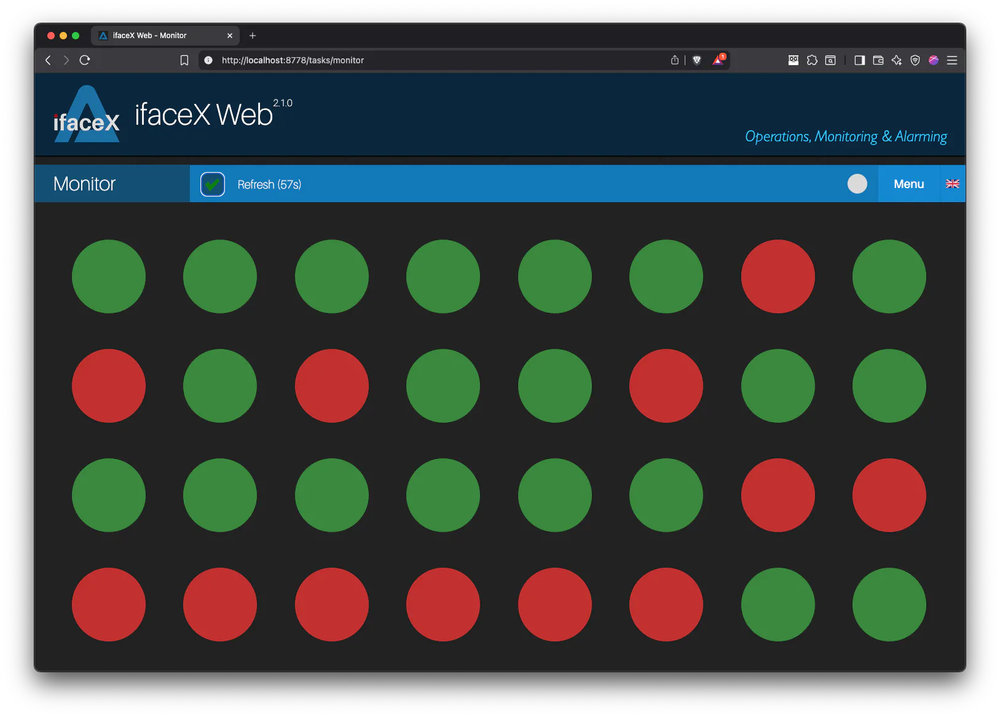
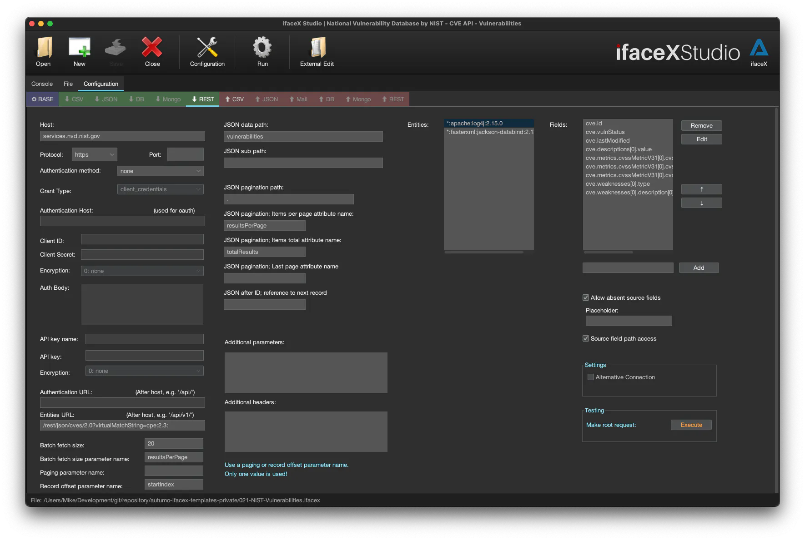

autumo Switzerland develops modular software solutions and products for developers and enterprises.

<table style="border-collapse: collapse; width: 100%;">
  <!-- Erste Produktreihe -->
  <tr>
    <td style="padding: 0;">
      

         
        <strong>autumo Beetroot</strong> – beetRoot is a lightweight and fast Java web and secure client-server framework that works out of the box. If you know CakePHP, you'll like beetRoot. It's based on the same principles and has a full CRUD generator that generates all views, model specification and controllers based on the database model. 
        <a href="https://github.com/autumoswitzerland/autumo-beetroot">Repo</a>
      

    </td>
    <td style="padding: 0;">
      

         
        <strong>autumo ifaceX</strong> - autumo ifaceX simplifies professional IT operations in monitoring their processes and Big Data interface exchange, integration and transformation, between clouds, databases and web interfaces for companies of any size. It is built to excel in enterprises with settled operation & monitoring. 
        <a href="https://ifacex.autumo.ch/">Product Page</a>
      

    </td>
  </tr>

  <!-- Zweite Produktreihe -->
  <tr>
    <td style="padding: 0;">
      

         
        <strong>autumo enterprise products</strong> -All software solutions, including medical and legal applications, web frameworks, data integration platforms, and AI-powered chatbots. 
        <a href="https://products.autumo.ch">Products</a>
      

    </td>
    <td style="padding: 0;">
      

         
        <strong>ifaceX Studio</strong> – The IDE / Studio for autumo ifaceX; configure and develop your IPCs within a GUI, configure your ifaceX installation and test your IPCs. 
        <a href="https://github.com/autumoswitzerland/autumo-studio">Repo</a>
      

    </td>
  </tr>
</table>
