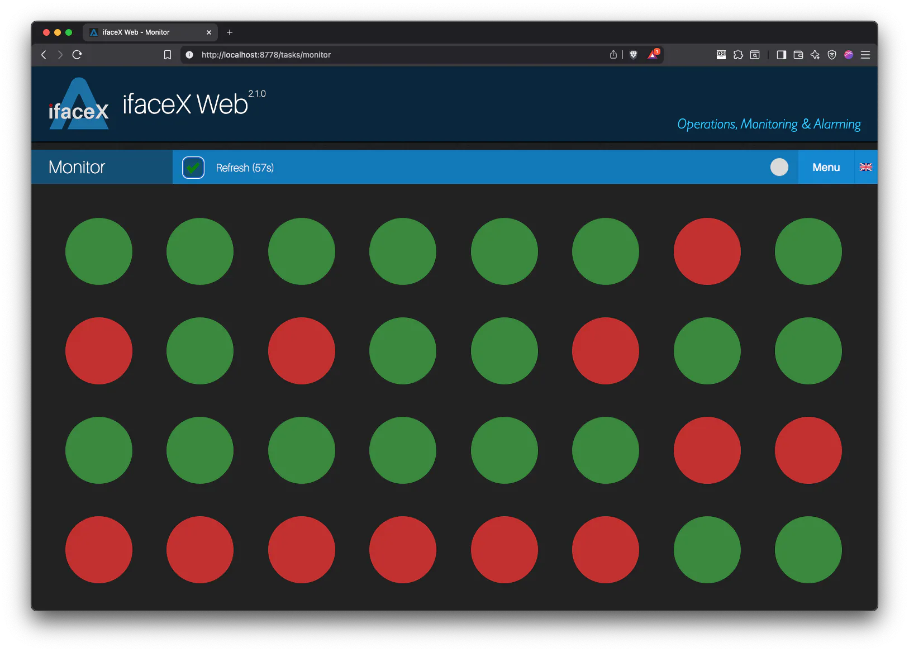
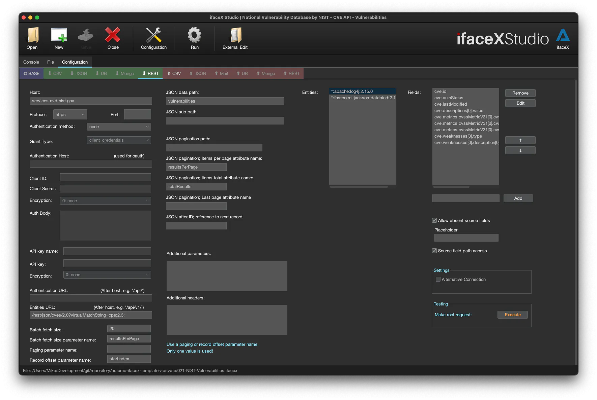

<strong>autumo Switzerland develops modular software solutions and products for developers and enterprises.</strong>

 

<table style="border-collapse: collapse; width: 100%;">

  <!-- ROW -->
  <tr>
    <td colspan="2" style="padding: 0;">
      

         
         
        <strong>jip</strong> – A pip-like dependency manager and runner for Java — clone it. Run it. Done. Clone a project, run it — jip handles dependencies, compilation, and execution in a single binary with a single slim config file.  
        <a href="https://github.com/autumoswitzerland/jip">Repo</a>  
      

    </td>
  </tr>

  <!-- Spacer -->
  <tr>
    <td style="padding: 0;">
      

      

    </td>
    <td style="padding: 0;">
      

      

    </td>
  </tr>
  
  <!-- ROW -->
  <tr>
    <td style="padding: 0;">
      

         
         
        <strong>WebDuck</strong> – A self-hosted DuckDB-as-a-Service server with REST API and Web UI. WebDuck is designed for web hosting providers who want to offer their customers a ready-to-use administration interface for DuckDB databases and data analytics — out of the box, just like the database admin tools that come with any hosting package.  
        <a href="https://github.com/autumoswitzerland/Webduck">Repo</a>  
      

    </td>
    <td style="padding: 0;">
      

         
         
         
         
         
        <strong>autumo Sentinel</strong> – A heuristic-driven, multi-stage scanner for detecting supply-chain malware, loaders, obfuscation, and persistence in source code, scripts, and build artifacts. Unlike signature-based scanners, it emphasizes contextual rule combinations to model realistic attack flows.  
        <a href="https://github.com/autumoswitzerland/autumo-sentinel">Repo</a>  
      

    </td>
  </tr>

  <!-- Spacer -->
  <tr>
    <td style="padding: 0;">
      

      

    </td>
    <td style="padding: 0;">
      

      

    </td>
  </tr>

  <!-- ROW -->
  <tr>
    <td style="padding: 0;">
      

         
         
        <strong>autumo Beetroot</strong> – beetRoot is a lightweight and fast Java web and secure client-server framework that works out of the box. If you know CakePHP, you'll like beetRoot. It's based on the same principles and has a full CRUD generator that generates all views, model specification and controllers based on the database model.  
        <a href="https://github.com/autumoswitzerland/autumo-beetroot">Repo</a>  
      

    </td>
    <td style="padding: 0;">
      

         
         
        <strong>autumo ifaceX</strong> - autumo ifaceX simplifies professional IT operations in monitoring their processes and Big Data interface exchange, integration and transformation, between clouds, databases and web interfaces for companies of any size. It is built to excel in enterprises with settled operation & monitoring.  
        <a href="https://ifacex.autumo.ch/">Product Page</a>  
      

    </td>
  </tr>

  <!-- Spacer -->
  <tr>
    <td style="padding: 0;">
      

      

    </td>
    <td style="padding: 0;">
      

      

    </td>
  </tr>

  <!-- ROW -->
  <tr>
    <td style="padding: 0;">
      

         
         
        <strong>autumo enterprise products</strong> -All software solutions, including medical and legal applications, web frameworks, data integration platforms, and AI-powered chatbots.  
        <a href="https://products.autumo.ch">Products</a>  
      

    </td>
    <td style="padding: 0;">
       
      

         
        <strong>ifaceX Studio</strong> – The IDE / Studio for autumo ifaceX; configure and develop your IPCs within a GUI, configure your ifaceX installation and test your IPCs.  
        <a href="https://github.com/autumoswitzerland/autumo-ifacex-studio-public">Repo</a>  
      

    </td>
  </tr>
</table>

